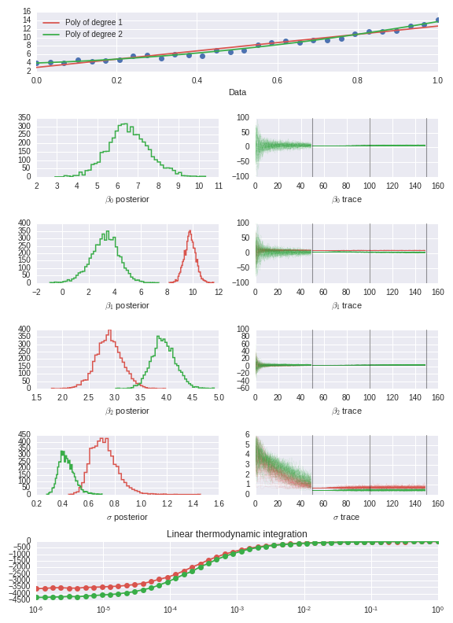

# Bayes Polynomial Test

This is a simple python module using the [emcee](http://dan.iel.fm/emcee/current/) 
MCMC implementation to estimate the Bayes factor between polynomial fits to
data. 

## Example

For a simple example, see the file `test.py`:

```python 
from BayesPolynomialTest import BayesPolynomialTest
import numpy as np

N = 10
m = 3
c = 10
x = np.linspace(0, 1, N)
y = m*x + c + np.random.normal(0, 0.5, N)
test = BayesPolynomialTest(x, y, degrees=[1, 2], ntemps=120, betamin=-6,
                           nburn0=50, nburn=50, nprod=50,
                           unif_lim=100)
test.diagnostic_plot()
test.BayesFactor()
```

This produces some fake data, fits a linear and quadratic function, generates
a diagnositic plot, and prints the Bayes factor. For one example the diagnostic
plot looks like this:



Then the Bayes factor is:

```bash
Bayes Factor (Poly of degree 2, Poly of degree 1) = 0.975 +/- 0.0338
```

This indicates that, in this instance, a quadratic fits the data better than a
linear fit.
